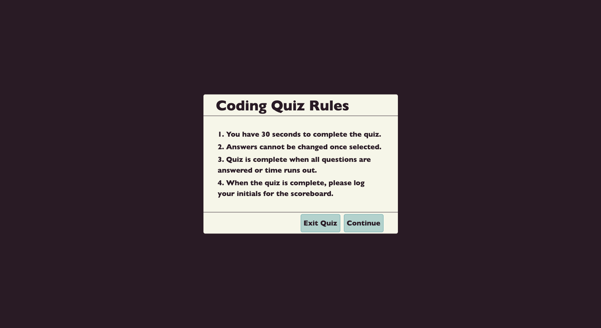
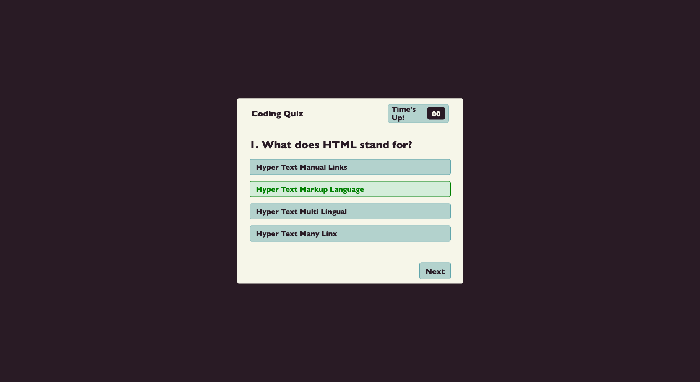

# challenge-04
Module 4 Challenge: Web API's Code Quiz for University of Arizona Coding Bootcamp

## **Table of Contents**
* [The Repository](#the-repository)
* [The Scenario](#the-scenario)
* [The Process](#the-process)
* [Requirements Met](#requirements-met)
* [Requirements Outstanding](#requirements-outstanding)
* [Result](#result)

### **The Repository**
This repository (challenge-04) contains HTML code, a CSS stylesheet, a script.js sheet for Javascript code and one for quizQuestions.js for the quiz question content. This is a submission for University of Arizona Coding Boot Camp.

### **The Scenario**
The task was to build a timed coding quiz with multiple choice questions. It should run in the browswer and be dynamically updated by HTML and CSS while powered by Javascript. A clean and responsive user interface is required.

### **The Process**
No starter code was provided for this project. I wrote (and rewrote and rewrote) the HTML, CSS, and Javascript.

### **Requirements Met**
* When the Start Quiz button is clicked, the User is presented first with a dialogue box outlining the rules of the quiz.
* The User may click the Exit Quiz button to abort the quiz or click the Continue button to move on to the quiz.
* The User is presented with the first question, and a timer begins a 20 second countdown.
* The User has a single opportunity to select an answer. Correct answers are highlighted green. Incorrect answers are highlighted red while the correct answer is presented in green.
* Answers cannot be changed, so then the User must click Next to move on.
* When time expires, the answers are unable to be chosen by the User.
* When all questions have been completed, the User's Score is reported.
* User can select "Replay Quiz" to take the quiz again or "Enter Score".

### **Requirements Outstanding**
* No penalty is made on the timer for incorrect answers.
* The ability to enter scores and the scoreboard is not yet functional.

### **Result**
The app is very pleasant to look at and the functionality is halfway there.

You can find my site at [Challenge-04](https://jlmayo.github.io/challenge-04/)

## **Completed Project**

